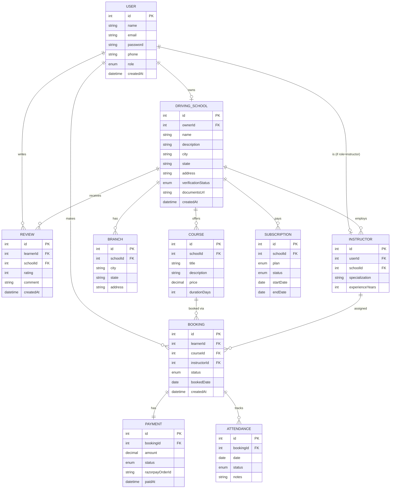

# DriveLearn India — Database Schema
### Part 1 / Day 2 — Database Schema Design

---

## Entity-Relationship Diagram

---

## Entity Details

### 1. User
Base table for all platform users — Super Admin, School Owner, Instructor, and Learner all share this table, differentiated by `role`.

| Field | Type | Notes |
|---|---|---|
| id | int, PK | Auto-increment |
| name | string | Required |
| email | string | Unique, required |
| password | string | Hashed (bcrypt) |
| phone | string | Required |
| role | enum | `admin`, `school_owner`, `instructor`, `learner` |
| createdAt | datetime | Default now |

### 2. DrivingSchool
One school profile per School Owner.

| Field | Type | Notes |
|---|---|---|
| id | int, PK | |
| ownerId | int, FK → User | One owner per school |
| name | string | |
| description | string | |
| city / state / address | string | Base location |
| verificationStatus | enum | `pending`, `verified`, `rejected` |
| documentsUrl | string | AWS S3 link to verification docs |
| createdAt | datetime | |

### 3. Branch
Supports schools with multiple locations.

| Field | Type | Notes |
|---|---|---|
| id | int, PK | |
| schoolId | int, FK → DrivingSchool | |
| city / state / address | string | |

### 4. Instructor
Linked to both a User account (for login) and a School (employer).

| Field | Type | Notes |
|---|---|---|
| id | int, PK | |
| userId | int, FK → User | Instructor's login identity |
| schoolId | int, FK → DrivingSchool | |
| specialization | string | e.g., "2-wheeler", "4-wheeler" |
| experienceYears | int | |

### 5. Course
Packages a school offers to learners.

| Field | Type | Notes |
|---|---|---|
| id | int, PK | |
| schoolId | int, FK → DrivingSchool | |
| title | string | |
| description | string | |
| price | decimal | |
| durationDays | int | |

### 6. Booking
Central table linking a learner, course, and instructor.

| Field | Type | Notes |
|---|---|---|
| id | int, PK | |
| learnerId | int, FK → User | |
| courseId | int, FK → Course | |
| instructorId | int, FK → Instructor | |
| status | enum | `pending`, `confirmed`, `completed`, `cancelled` |
| bookedDate | date | |
| createdAt | datetime | |

### 7. Payment
One-to-one with Booking.

| Field | Type | Notes |
|---|---|---|
| id | int, PK | |
| bookingId | int, FK → Booking | Unique |
| amount | decimal | |
| status | enum | `pending`, `success`, `failed` |
| razorpayOrderId | string | |
| paidAt | datetime | |

### 8. Subscription
School's recurring platform fee — tracks history, not just current state.

| Field | Type | Notes |
|---|---|---|
| id | int, PK | |
| schoolId | int, FK → DrivingSchool | |
| plan | enum | `monthly`, `yearly` |
| status | enum | `active`, `expired` |
| startDate / endDate | date | |

### 9. Review
Learner feedback on a school, post-course.

| Field | Type | Notes |
|---|---|---|
| id | int, PK | |
| learnerId | int, FK → User | |
| schoolId | int, FK → DrivingSchool | |
| rating | int | 1–5 |
| comment | string | |
| createdAt | datetime | |

### 10. Attendance
Instructor-marked, tied to a specific booking (lesson).

| Field | Type | Notes |
|---|---|---|
| id | int, PK | |
| bookingId | int, FK → Booking | |
| date | date | |
| status | enum | `present`, `absent` |
| notes | string | Optional progress notes |

---

## Relationship Summary

| Relationship | Type |
|---|---|
| User → DrivingSchool | One-to-One (owner) |
| DrivingSchool → Branch | One-to-Many |
| DrivingSchool → Instructor | One-to-Many |
| DrivingSchool → Course | One-to-Many |
| DrivingSchool → Subscription | One-to-Many (history) |
| DrivingSchool → Review | One-to-Many |
| User (learner) → Booking | One-to-Many |
| Course → Booking | One-to-Many |
| Instructor → Booking | One-to-Many |
| Booking → Payment | One-to-One |
| Booking → Attendance | One-to-Many |
| User (learner) → Review | One-to-Many |

---