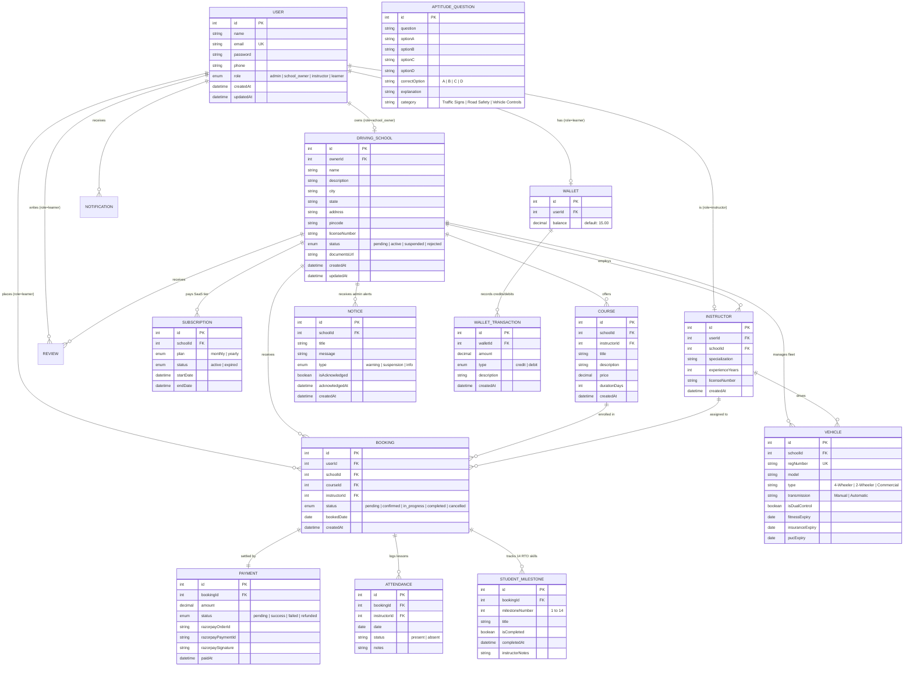

# 🗄️ DriveLearn India — Complete Database Schema & Entity Architecture

Comprehensive entity-relationship specification for the DriveLearn India SaaS Marketplace and Learning Management System, mapped directly to PostgreSQL via Prisma ORM.

---

## 📐 Entity-Relationship Diagram (ERD)

```mermaid
erDiagram
    USER ||--o| DRIVING_SCHOOL : "owns (role=school_owner)"
    USER ||--o| INSTRUCTOR : "is (role=instructor)"
    USER ||--o| WALLET : "has (role=learner)"
    USER ||--o{ BOOKING : "places (role=learner)"
    USER ||--o{ REVIEW : "writes (role=learner)"
    USER ||--o{ NOTIFICATION : "receives"

    DRIVING_SCHOOL ||--o{ SUBSCRIPTION : "pays SaaS tier"
    DRIVING_SCHOOL ||--o{ INSTRUCTOR : "employs"
    DRIVING_SCHOOL ||--o{ VEHICLE : "manages fleet"
    DRIVING_SCHOOL ||--o{ COURSE : "offers"
    DRIVING_SCHOOL ||--o{ BOOKING : "receives"
    DRIVING_SCHOOL ||--o{ REVIEW : "receives"
    DRIVING_SCHOOL ||--o{ NOTICE : "receives admin alerts"

    COURSE ||--o{ BOOKING : "enrolled in"
    INSTRUCTOR ||--o{ BOOKING : "assigned to"
    INSTRUCTOR ||--o{ VEHICLE : "drives"

    BOOKING ||--|| PAYMENT : "settled by"
    BOOKING ||--o{ ATTENDANCE : "logs lessons"
    BOOKING ||--o{ STUDENT_MILESTONE : "tracks 14 RTO skills"

    WALLET ||--o{ WALLET_TRANSACTION : "records credits/debits"

    USER {
        int id PK
        string name
        string email UK
        string password
        string phone
        enum role "admin | school_owner | instructor | learner"
        datetime createdAt
        datetime updatedAt
    }

    DRIVING_SCHOOL {
        int id PK
        int ownerId FK
        string name
        string description
        string city
        string state
        string address
        string pincode
        string licenseNumber
        enum status "pending | active | suspended | rejected"
        string documentsUrl
        datetime createdAt
        datetime updatedAt
    }

    SUBSCRIPTION {
        int id PK
        int schoolId FK
        enum plan "monthly | yearly"
        enum status "active | expired"
        datetime startDate
        datetime endDate
    }

    INSTRUCTOR {
        int id PK
        int userId FK
        int schoolId FK
        string specialization
        int experienceYears
        string licenseNumber
        datetime createdAt
    }

    VEHICLE {
        int id PK
        int schoolId FK
        string regNumber UK
        string model
        string type "4-Wheeler | 2-Wheeler | Commercial"
        string transmission "Manual | Automatic"
        boolean isDualControl
        date fitnessExpiry
        date insuranceExpiry
        date pucExpiry
    }

    COURSE {
        int id PK
        int schoolId FK
        int instructorId FK
        string title
        string description
        decimal price
        int durationDays
        datetime createdAt
    }

    BOOKING {
        int id PK
        int userId FK
        int schoolId FK
        int courseId FK
        int instructorId FK
        enum status "pending | confirmed | in_progress | completed | cancelled"
        date bookedDate
        datetime createdAt
    }

    PAYMENT {
        int id PK
        int bookingId FK
        decimal amount
        enum status "pending | success | failed | refunded"
        string razorpayOrderId
        string razorpayPaymentId
        string razorpaySignature
        datetime paidAt
    }

    STUDENT_MILESTONE {
        int id PK
        int bookingId FK
        int milestoneNumber "1 to 14"
        string title
        boolean isCompleted
        datetime completedAt
        string instructorNotes
    }

    ATTENDANCE {
        int id PK
        int bookingId FK
        int instructorId FK
        date date
        string status "present | absent"
        string notes
    }

    WALLET {
        int id PK
        int userId FK
        decimal balance "default: 15.00"
    }

    WALLET_TRANSACTION {
        int id PK
        int walletId FK
        decimal amount
        enum type "credit | debit"
        string description
        datetime createdAt
    }

    NOTICE {
        int id PK
        int schoolId FK
        string title
        string message
        enum type "warning | suspension | info"
        boolean isAcknowledged
        datetime acknowledgedAt
        datetime createdAt
    }

    APTITUDE_QUESTION {
        int id PK
        string question
        string optionA
        string optionB
        string optionC
        string optionD
        string correctOption "A | B | C | D"
        string explanation
        string category "Traffic Signs | Road Safety | Vehicle Controls"
    }
```

---

## 📋 Entity Descriptions & Business Rules

### 1. `User`
- Central identity entity for all platform actors.
- Roles enforced via `Role` enum: `admin`, `school_owner`, `instructor`, `learner`.
- Passwords salted and hashed via `bcryptjs`.

### 2. `DrivingSchool`
- Represents a verified driving academy registered on DriveLearn India.
- Managed by a single `school_owner` user.
- Status transitions: `pending` $\rightarrow$ `active` $\rightarrow$ `suspended`.

### 3. `Subscription`
- B2B SaaS license for driving schools to remain listed and operational.
- Plans: `monthly` (₹999/mo) and `yearly` (₹8,999/yr).
- Super Admin can grant 1-year free exemptions or apply custom duration overrides.

### 4. `Vehicle`
- Manages driving academy dual-pedal fleet assets.
- Telematics metadata: RTO registration plate, transmission (Manual/Automatic), dual-control certification, fitness expiry, insurance expiry, and PUC expiry dates.

### 5. `StudentMilestone`
- Standardized 14 practical milestone driving curriculum (ABC pedals, clutch bite point, steering slalom, RTO 8-track, H-track bay parking, hill start without rollback, night driving, simulator exam).

### 6. `Wallet` & `WalletTransaction`
- Automatic ₹15 welcome bonus credited upon learner registration.
- Auto-applied as instant checkout discounts on course bookings.

### 7. `Notice`
- Administrative compliance communication channel from Super Admin to School Owners.
- Tracks formal warning notices, temporary suspensions, and compliance acknowledgments.

---

© 2026 DriveLearn India Pvt. Ltd. · Database Schema Architecture